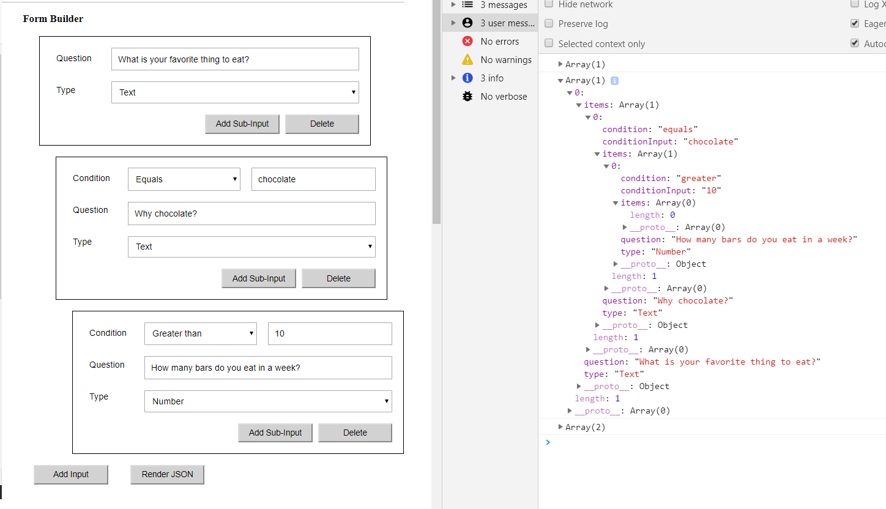

## formbuilder

Formbuilder is a website app in React that allows to generate form with inputs and subinputs recursively and handles typed in data. 
All data is stored in **this.state.items** - to see it in console click "render json".
You can add and delete everything to freely modify the structure.

**to run**:

`npm i`

 ` npx webpack`
 
 

